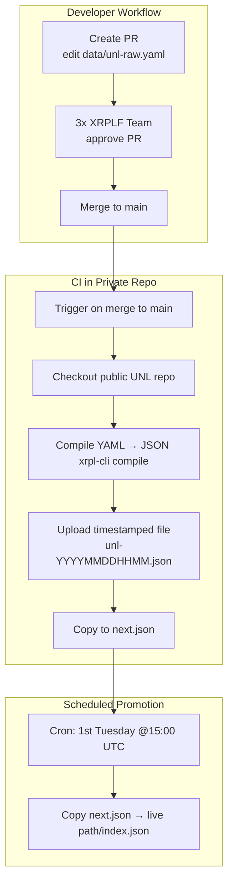

# Unique Node List (UNL)

The XRP Ledger Foundation maintains a Unique Node List (UNL) for the XRPL. This repo is the source for the `UNL`, published at [https://unl.xrplf.org](https://unl.xrplf.org/).

## Editing the UNL

The process of creating an updated signed UNL is outlined below.

- To suggest an update to this list, [make a Pull Request](https://github.com/XRPLF/unl/pulls).
- Only changes to `data/unl-raw.yaml` are required in your Pull Request.
- Once the PR has been approved and merged into the `main` branch, an automation workflow will run to create a new signed UNL.
- The signed UNL file will be uploaded to Google Cloud Storage, named `unl/unl-$timestamp.json`.
- Simultaneously, the same file will be copied to `unl/next.json` which contains the latest version, however not necessarily the currently published version.
- A cron job will run once per month on the first Tuesday of the month at 15:00 UTC which will:
  - Copy the `unl/next.json` file to `unl.json` (promote to live).

